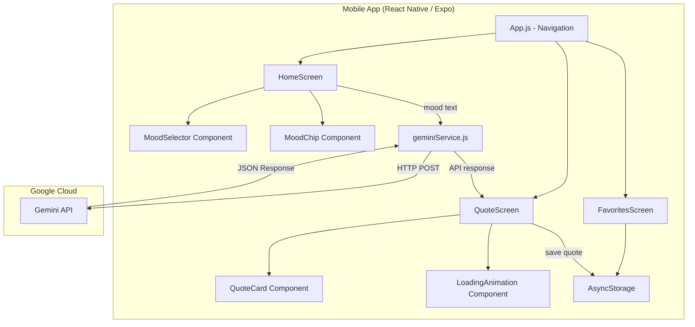
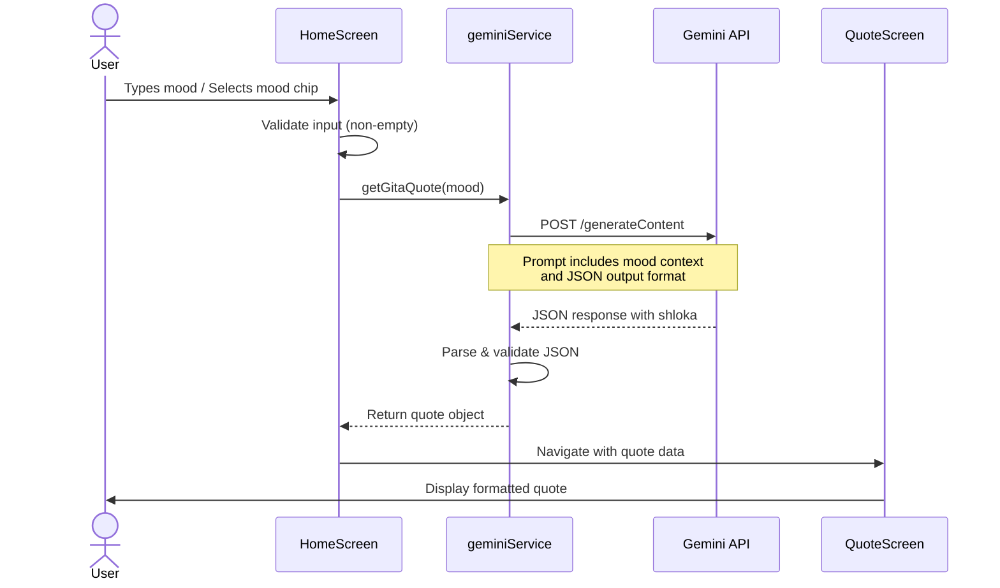
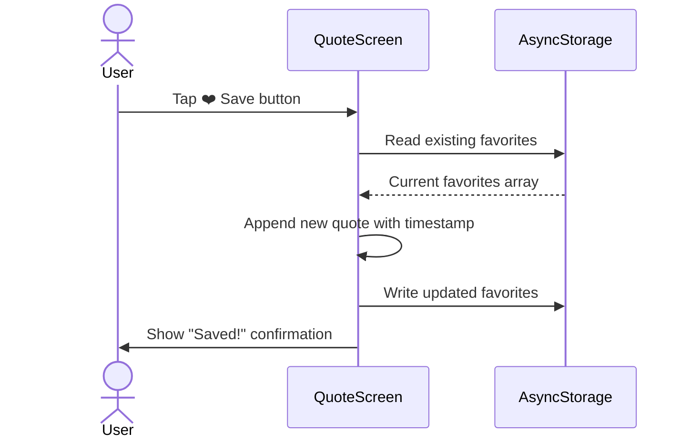

# GitaVani — Architecture Document

## System Architecture



---

## Data Flow

### Quote Generation Flow



### Save Quote Flow



---

## Component Hierarchy

```
App.js
├── NavigationContainer
│   └── Stack.Navigator
│       ├── HomeScreen
│       │   ├── LinearGradient (background)
│       │   ├── Header (title + icon)
│       │   ├── TextInput (mood text)
│       │   ├── MoodSelector
│       │   │   └── MoodChip × N (scrollable)
│       │   ├── GetQuoteButton
│       │   └── LoadingAnimation (conditional)
│       │
│       ├── QuoteScreen
│       │   ├── LinearGradient (background)
│       │   ├── QuoteCard
│       │   │   ├── Sanskrit Verse
│       │   │   ├── Reference (Chapter:Verse)
│       │   │   ├── Transliteration
│       │   │   ├── Translation
│       │   │   └── Explanation
│       │   └── ActionButtons (Save / Share / Another)
│       │
│       └── FavoritesScreen (Phase 2)
│           └── FlatList
│               └── QuoteCard × N
```

---

## State Management

| State | Location | Description |
|-------|----------|-------------|
| `moodText` | HomeScreen (local) | User-typed mood string |
| `selectedMood` | HomeScreen (local) | Currently selected mood chip |
| `isLoading` | HomeScreen (local) | API call loading state |
| `quote` | QuoteScreen (route params) | Current quote data from API |
| `favorites` | AsyncStorage | Persisted saved quotes |

No global state management (Redux/Context) needed for MVP — all state is either local to screens or passed via navigation params.

---

## Error Handling Strategy

| Error Type | Handling |
|------------|----------|
| **Network offline** | Check `NetInfo` before API call → show "No internet" toast |
| **API rate limit (429)** | Show "Too many requests, try in a minute" message |
| **API key invalid (401/403)** | Show setup instructions, link to env config |
| **Malformed JSON from Gemini** | Retry once with stricter prompt; if still fails, show fallback quote |
| **Empty mood input** | Disable button + show validation hint |
| **API timeout** | 15-second timeout → "Taking too long, please try again" |

---

## Security

- **API Key**: Stored in `.env`, loaded via `react-native-dotenv`, gitignored
- **No user data collected**: No auth, no analytics, no tracking
- **All data local**: Favorites stored only on device via AsyncStorage

> [!WARNING]
> The API key is bundled into the app binary in React Native. For production distribution beyond personal use, consider setting up a lightweight backend proxy to hide the key.
